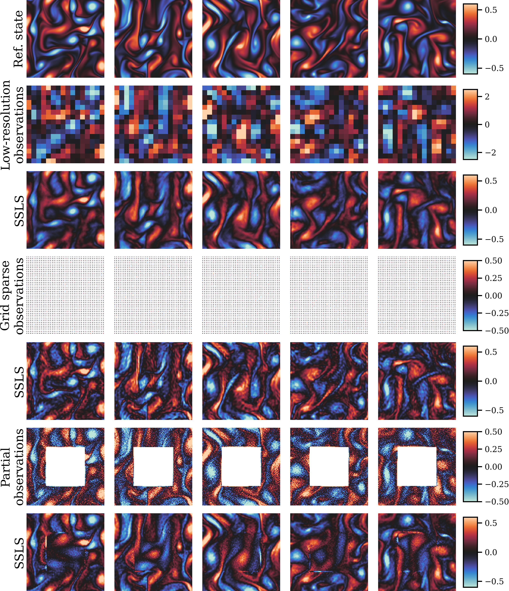

# Score-Based Sequential Langevin Monte Carlo for Nonlinear Assimilation

------



## Dependencies
```bash
pip install -r requirements
```

### Structure
```txt
├── README.md
|-- configs
|   |-- kolmogorov.json # configurations for KFlow
|   |-- lorenz96.json # configurations for Lorenz 96
|   `-- mplrc # custom matplotlib configurations for visualization
|-- main.py # entrance
├── notebooks
│   ├── KolmogorovAbalation.ipynb # reproducing Figure 11
│   ├── KolmogorovEvolution.ipynb # reproducing Figure 9
│   ├── KolmogorovMLE.ipynb # w/o prior assimilation
│   ├── KolmogorovMetrics.ipynb # reproducing Figure 14
│   ├── KolmogorovUQ.ipynb # reproducing Figure 10
│   ├── LinearGaussianSSM.ipynb # reproducing Figure 3
│   ├── LorenzAuxiliaryParticleFilter.ipynb # APF with infation for Lorenz 96
│   ├── LorenzEnsemble.ipynb # reproducing Figure 12
│   ├── LorenzEvolution.ipynb # reproducing Figure 7
│   ├── LorenzKalmanFilter.ipynb # EnKF for Lorenz 96
│   ├── LorenzMetrics.ipynb # reproducing Figure 8
│   └── LorenzTrajectory.ipynb # reproducing Figure 13
|-- requirements.txt 
`-- src
|   |-- __init__.py
|   |-- dynamics
|   |   |-- __init__.py
|   |   |-- base.py # abstract dynamics class 
|   |   |-- kolmogorov.py # Kolmogorov flow dynamics
|   |   `-- lorenz96.py # Lorenz 96 dynamics
|   |-- measurements
|   |   |-- __init__.py
|   |   |-- avg_pool.py # average pooling for KFlow
|   |   |-- base.py # abstract measurement class
|   |   |-- center_mask.py # center mask for KFlow
|   |   |-- grid_mask.py # grid mask for KFlow
|   |   |-- linear.py # linear observation for Lorenz 96
|   |   `-- random_mask.py # random mask for KFlow
|   |-- networks
|   |   |-- __init__.py
|   |   |-- mlp.py # multilayer perceptron
|   |   |-- unet1d.py # 1D UNet for Lorenz 96
|   |   `-- unet2d.py # 2D UNet for KFlow
|   |-- train
|   |   `-- train.py # training loop
|   `-- utils.py # auxiliaries
```

## How to train
```bash
python main.py lorenz96|kolmogorov --device cpu|cuda
```

## How to reproduce
1. Download our results (processed pkl files, around 103.6 MB) available at [Google drive](https://drive.google.com/drive/folders/14ZlxS7k-gKi9YCqbiP2Wth2qI_381Go7?usp=sharing) to the `asset` folder
2. Run the corresponding Jupyter Notebooks, you only need to run the first and the last code block for importing dependent libraries and plotting, respectively.

## How to extend
If you wish to try your own dynamics and new observation models, please refer to the `src/dynamics/base.py` and `src/measurements/base.py`, inherit from the `Dynamics` and `Measurement` abstract class.

For `Dynamics`, you should provide `prior` and `transition` method for initial prior guess and transition of the dynamics, and for `Measurement`, you should provide `_measure` and `measure` method for computing score of likelihood and measurements itself.


## References
This repository is built upon some previous repositories

> Kolmogorov Flow from SDA https://github.com/francois-rozet/sda

> UNet2D from DDIM https://github.com/ermongroup/ddim

If you find the code useful for your research, please consider citing

```bib
@misc{ssls,
      title={}, 
      author={},
      year={2024},
      eprint={},
      archivePrefix={arXiv},
}
```