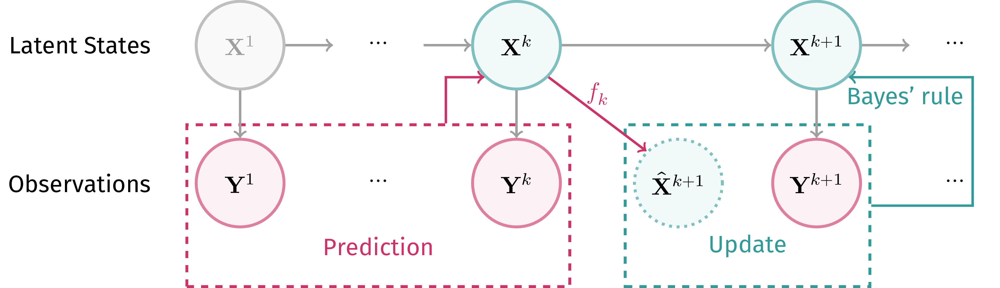
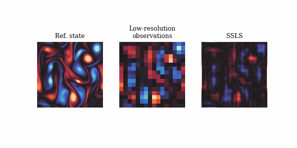

# Nonlinear Assimilation with <span style="color: red;">S</span>core-based <span style="color: red;">S</span>equential <span style="color: red;">L</span>angevin <span style="color: red;">S</span>ampling

Zhao Ding<sup>1</sup>, Chenguang Duan<sup>1</sup>, Yuling Jiao<sup>1</sup>, Jerry Zhijian Yang<sup>1</sup>, Cheng Yuan<sup>2</sup> and Pingwen Zhang<sup>1,3</sup>

<sup>1</sup> Wuhan University, <sup>2</sup> Central China Normal University, <sup>3</sup> Peking University

[](https://github.com/burning489/SSLS)
[](https://arxiv.org/abs/2411.13443)

## Brief
We propose nonlinear assimilation method called score-based sequential Langevin sampling (SSLS) within a Bayesian recursive framework.

## Problem Setup
Consider the following system:
$$
  \begin{align*}
    \mathbf{X}^{k+1} & =f_{k}(\mathbf{X}^{k}, \eta^{k}), \quad k \geq 1, \\
    \mathbf{Y}^{k} & =g_{k}(\mathbf{X}^{k}, \xi^{k}), \quad k \geq 1,
  \end{align*}
$$
where $\mathbf{X}_k$ is the latent states of interests evolved by $f_k$, and $\mathbf{Y}_k$ is the observations under measurement $g_k$. Here we assume that $\eta^k$ and $\xi^k$ are noises with known distributions. 

__The goal of Data Assimilation__:
Given historical observations $\mathbf{y}^{[k]}$, ($[k]$ stands for $\{1, \cdots, k\}$), estimate the posterior distribution of the latent states: $p_{\mathbf{X}^{k}|\mathbf{Y}^{[k]} = \mathbf{y}^{[k]}}$.


## Recursive Bayesian Framework
Our work is carried out under the recursive Bayesian framework described below:
$$
\begin{align*}
    & p_{\mathbf{X}^k|\mathbf{Y}^{[k]}}(\mathbf{x}|\mathbf{y}^{[k]}) \\
    \propto & {\color{orange} p_{\mathbf{Y}^{[k]}|\mathbf{X}^{k}}(\mathbf{y}^{[k]}|\mathbf{x})} {\color{teal} p_{\mathbf{X}^{k}}(\mathbf{x})} \\
    \propto & {\color{orange} p_{\mathbf{Y}^{k}|\mathbf{X}^{k}}(\mathbf{y}^{k}|\mathbf{x})} \cancel{\color{orange}p_{\mathbf{Y}^{[k-1]} | (\mathbf{X}^{k}, \mathbf{Y}^{k})}(\mathbf{y}^{[k-1]}|\mathbf{x}, \mathbf{y}^{k})} \frac{\color{teal} p_{\mathbf{X}^{k}|\mathbf{Y}^{[k-1]}}(\mathbf{x}|\mathbf{y}^{[k-1]})}{\cancel{\color{teal} p_{\mathbf{Y}^{[k-1]}|\mathbf{X}^{k}}(\mathbf{y}^{[k-1]}|\mathbf{x})}} \\
    = & {\color{orange} p_{\mathbf{Y}^{k}|\mathbf{X}^{k}}(\mathbf{y}^{k}|\mathbf{x})}  {\color{teal}p_{\mathbf{X}^{k}|\mathbf{Y}^{[k-1]}}(\mathbf{x}|\mathbf{y}^{[k-1]})}
  \end{align*}
  $$

## Langevin Monte Carlo
The posterior score now can be decomposed as the sum of likelihood score and prior score:
$$ \underbrace{\nabla \log p_{\bf{X}_k|\bf{Y}_{[k]}} (\bf{x}|\bf{y}_{[k]})}_\text{score of posterior} = \nabla \log \underbrace{p_{\bf{Y}_k|\bf{X}_{k}}(\bf{y}_k|\bf{x})}_\text{likelihood} + \underbrace{\nabla \log p_{\bf{X}_k|\bf{Y}_{[k-1]}}(\bf{x}|\bf{y}_{[k-1]})}_\text{score of prior}. $$
The likelihood score can be computed with known measurement model and noises.
As for the prior score, we exploit the score matching technique at each time step, given the prior ensemble from last step.

After assembling the posterior score, we can use any Langevin-type sampling method to derive samples from the posterior distribution, starting from the transitioned ensemble from last time step.


## Flow Chart
We provide a flow chart below.




## Pseudocode
We provide the python-like pseudocode below.
```python
prior = sample_from_prior()
for i in range(k+1):
    prior_score = score_matching(prior) # sliced / implicit / denoising
    posterior_score = lambda x: grad_log_likelihood(x, y[i]) + prior_score(x)
    posterior = langevin(prior, posterior_score) # any Langevin-type sampling method
    prior = dynamics_transition(posterior)
```

## Numerical Results

Numerical examples demonstrate its outstanding performance in high-dimensional and nonlinear scenarios, as well as in situations with sparse or partial measurements.
Please refer to our paper for more results.




## Citing
If you find our work useful for your research, please consider citing

```bib
@misc{ding2024nonlinearassimilationscorebasedsequential,
      title={Nonlinear Assimilation with Score-based Sequential Langevin Sampling}, 
      author={Zhao Ding and Chenguang Duan and Yuling Jiao and Jerry Zhijian Yang and Cheng Yuan and Pingwen Zhang},
      year={2024},
      eprint={2411.13443},
      archivePrefix={arXiv},
      primaryClass={math.NA},
      url={https://arxiv.org/abs/2411.13443}, 
}
```